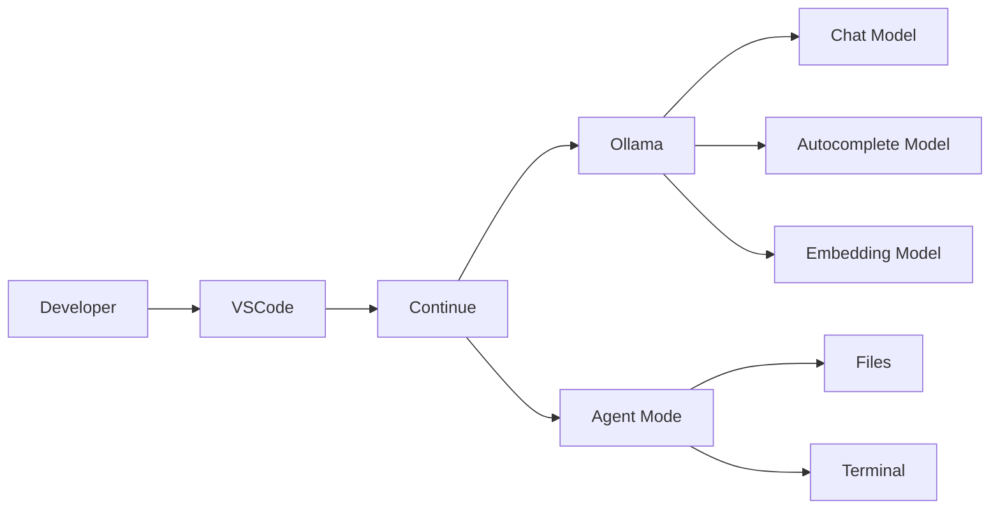

# 🚀 Local AI Coding Setup (Ubuntu + Ollama + VS Code + Continue)


> Build a **100% local, private, and free AI coding environment** using Ollama, VS Code and Continue.dev.

## Table of Contents
1. Overview
2. Architecture
3. VM Specifications
4. Install Ollama
5. Download Models
6. Configure Context Length
7. Expose Ollama on Port 11434
8. Configure Firewall
9. Install VS Code + Continue
10. Configure Chat / Autocomplete / Embedding
11. Enable Agent Mode
12. Optional Claude Code
13. Troubleshooting
14. Useful Commands
15. References

## Overview

**Features**

- Local LLMs
- Private code
- No API costs
- Chat mode
- Autocomplete
- Embedding search
- Agent mode

## Architecture



## VM Specifications

- Ubuntu 26
- 11 GB RAM
- 5 vCPUs

### Recommended Models

| Purpose | Model |
|---|---|
| Chat | glm-4.7-flash |
| Alternative | gpt-oss:20b (may be slow) |
| Autocomplete | qwen2.5-coder:1.5b |
| Embedding | nomic-embed-text |

## Install Ollama

```bash
curl -fsSL https://ollama.com/install.sh | sh
ollama --version
```

## Download Models

```bash
ollama pull glm-4.7-flash / ollama pull qwen2.5-coder:7b / ollama pull qwen2.5:3b
ollama pull qwen2.5-coder:1.5b
ollama pull nomic-embed-text
# optional
ollama pull gpt-oss:20b
```

## Configure Context Length

Recommended: **16384** for 11 GB RAM.

```bash
echo 'export OLLAMA_CONTEXT_LENGTH=16384' >> ~/.bashrc
source ~/.bashrc
```

Verify:

```bash
ollama run glm-4.7-flash
ollama ps
```

## Expose Ollama on Port 11434

Edit:

```bash
sudo vi /etc/systemd/system/ollama.service
```

Under `[Service]`:

```ini
Environment="OLLAMA_HOST=0.0.0.0:11434"
Environment="OLLAMA_ORIGINS=*"
```

Reload:

```bash
sudo systemctl daemon-reload
sudo systemctl restart ollama
sudo systemctl status ollama
```

## Configure Firewall

```bash
sudo ufw allow 11434/tcp
sudo ufw reload
sudo ufw status verbose
```

Test:

```bash
curl http://<VM-IP>:11434/api/tags
```

## Install VS Code + Continue

1. Install VS Code
2. Install **Continue** extension
3. Select **Ollama**
4. Connect to `http://<VM-IP>:11434`

Configure:

- Chat → `glm-4.7-flash`
- Autocomplete → `qwen2.5-coder:1.5b`
- Embedding → `nomic-embed-text`

## Enable Agent Mode

Continue → Settings → Tools

Enable built-in tools and set to **Automatic**.

Capabilities:

- Create/Edit files
- Read repositories
- Execute terminal commands
- Multi-file changes

## Optional Claude Code

```bash
curl -fsSL https://claude.ai/install.sh | bash
ollama launch claude --model glm-4.7-flash
```

## Troubleshooting

| Issue | Fix |
|---|---|
| Continue can't connect | Verify OLLAMA_HOST and port 11434 |
| Connection refused | Allow UFW rule |
| Slow model | Use glm-4.7-flash |
| High RAM | Keep context at 16384 |
| Agent cannot edit | Enable tools |

## Useful Commands

```bash
ollama ls
ollama ps
ollama run glm-4.7-flash
ollama stop glm-4.7-flash
journalctl -u ollama -f
```

## References

- https://ollama.com
- https://docs.ollama.com
- https://docs.ollama.com/linux
- https://docs.ollama.com/context-length
- https://docs.ollama.com/integrations/claude-code
- https://ollama.com/library
- https://continue.dev
- https://docs.continue.dev

